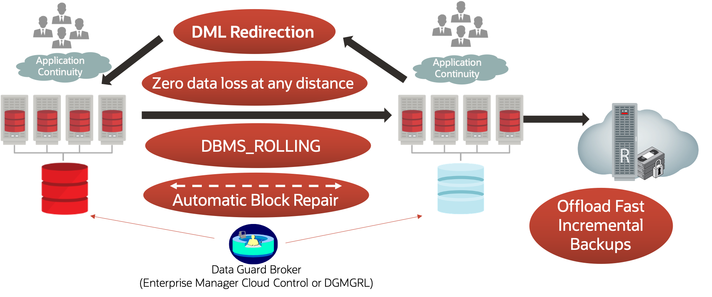

# Oracle Site Guard Fundamentals

## Introduction

Oracle Site Guard assures comprehensive business continuity by providing fully automated, end-to-end disaster recovery for the entire Oracle stack

Oracle Site Guard assures comprehensive business continuity by providing fully automated, end-to-end, disaster recovery for the entire Oracle stack including web tier, application tier, databases, virtual infrastructure, and storage.Site Guard is ready out of the box to handle disaster recovery for Oracle Fusion Applications and Middleware, Oracle Databases, Oracle Virtual Machine, and Sun ZFS Storage.

Site Guard is flexible and easily integrates with various platforms including Oracle Exadata, Oracle Exalogic, and Oracle Private Cloud Appliance (PCA). Site Guard capabilities can also be easily extended to protect non-Oracle applications and infrastructure.

Using Site Guard you can:

•	Provide comprehensive protection for your entire Oracle stack

•	Simplify disaster recovery operations and minimize recovery time (RTO)

•	Achieve a zero loss Recovery Point Objective (RPO) for Oracle Database recovery

•	Assure disaster recovery readiness using on-demand or scheduled DR drills

•	Create highly flexible and customized disaster recovery plans

•	Fully automate disaster recovery operations and launch them with a single click

•	Use a single pane of glass for monitoring DR readiness and for launching and monitoring DR workflows

•	Eliminate the need for domain specialists and dedicated administrators for disaster recovery

This workshop focuses on **Testing out various Disaster recovery plans such as Start,Stop,Switchover site with Oracle Site guard using preconfigured VM which has Oracle DB,Oracle Weblogic Server and Oracle Enterprise manager**.

Estimated Workshop Time: 3 Hours

### Workshop Objectives
- Create the primary database
- Create the standby database
- Connect to the database
- Perform a switchover
- Perform a failover
- Enable Active Data Guard DML Redirection
- Automatic block media recovery
- Restore point propagation
- Change the SYS password

### Prerequisites
- An Oracle Cloud Account - Please view this workshop's LiveLabs landing page to see which environments are supported

*Note: If you have a **Free Trial** account, when your Free Trial expires your account will be converted to an **Always Free** account. You will not be able to conduct Free Tier workshops unless the Always Free environment is available. **[Click here for the Free Tier FAQ page.](https://www.oracle.com/cloud/free/faq.html)***

## Disclaimer
The following is intended to outline our general product direction. It is intended for information purposes only, and may not be incorporated into any contract. It is not a commitment to deliver any material, code, or functionality, and should not be relied upon in making purchasing decisions. The development, release, and timing of any features or functionality described for Oracle’s products remains at the sole discretion of Oracle.

## Acknowledgements

- **Author** -  Suraj Ramesh, Principal Product Manager & Eugene Simos,Principal Domain Specialist Cloud Engineer
- **Last Updated By/Date** -  Suraj Ramesh,March 2022
