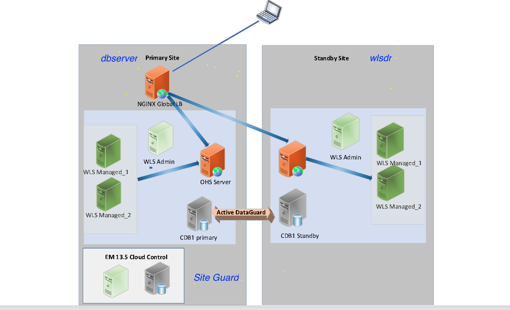

# Oracle Site Guard Fundamentals

## Introduction

Oracle Site Guard assures comprehensive business continuity by providing fully automated, end-to-end disaster recovery for the entire Oracle stack

Oracle Site Guard assures comprehensive business continuity by providing fully automated, end-to-end, disaster recovery for the entire Oracle stack including web tier, application tier, databases, virtual infrastructure, and storage.Site Guard is ready out of the box to handle disaster recovery for Oracle Fusion Applications and Middleware, Oracle Databases, Oracle Virtual Machine, and Sun ZFS Storage.

Site Guard is flexible and easily integrates with various platforms including Oracle Exadata, Oracle Exalogic, and Oracle Private Cloud Appliance (PCA). Site Guard capabilities can also be easily extended to protect non-Oracle applications and infrastructure.

**Oracle Site Guard works on top of enterprise manager and its in built with Oracle Enterprise manager**.

Using Site Guard you can:

•	Provide comprehensive protection for your entire Oracle stack

•	Simplify disaster recovery operations and minimize recovery time (RTO)

•	Achieve a zero loss Recovery Point Objective (RPO) for Oracle Database recovery

•	Assure disaster recovery readiness using on-demand or scheduled DR drills

•	Create highly flexible and customized disaster recovery plans

•	Fully automate disaster recovery operations and launch them with a single click

•	Use a single pane of glass for monitoring DR readiness and for launching and monitoring DR workflows

•	Eliminate the need for domain specialists and dedicated administrators for disaster recovery

This workshop focuses on **testing out various Disaster recovery plans such as Start,Stop,Switchover site with Oracle Site guard using preconfigured VM which has Oracle DB,Oracle Weblogic Server and Oracle Enterprise manager**.

Estimated Workshop Time: 3 Hours

### Environment details:

- Two VM's dbserver and wlsdr will be created
- As per the architecture diagram dbserver is designated as Primary Site and wlsdr is designated as Disaster Recovery site
- dbserver has Oracle Enterprise manager 13.5 (Site Guard),Oracle Database 19c with Data guard ( Primary DB), Oracle Weblogic 12c  (Application)
- wlsdr has Oracle Database 19c with Dataguard ( Standby DB), Oracle Weblogic 12c(Application)
- Various Site Guard configurations such as creating sites, credentials, plans are already pre-created. For additional information how to do that you can refer the Site guard documentation in the reference links section.

### Workshop Objectives:

- By using Start operation type in Site Guard to start Weblogic application in dbserver
- By using Switchover operation type in Site Guard to switchover Full Stack of Weblogic App and Database from dbserver to wlsdr
- By using Switchover operation type in Site Guard  to switchover Full Stack of Weblogic App and Database from wlsdr to dbserver
- By using Stop operation type in Site Guard to stop Weblogic application in dbserver

### Reference links:

* [Oracle Enterprise manager](https://docs.oracle.com/en/enterprise-manager/cloud-control/enterprise-manager-cloud-control/13.5/emcon/enterprise-manager-cloud-control-architecture.html#GUID-C846F54D-5A14-47BB-869D-AC0265169FE3)

* [Oracle Site Guard documentation](https://docs.oracle.com/en/enterprise-manager/cloud-control/enterprise-manager-cloud-control/13.4/guard/site-guard-administrators-guide.pdf)

### Prerequisites:

- An Oracle Cloud Account - Please view this workshop's LiveLabs landing page to see which environments are supported

*Note: If you have a **Free Trial** account, when your Free Trial expires your account will be converted to an **Always Free** account. You will not be able to conduct Free Tier workshops unless the Always Free environment is available. **[Click here for the Free Tier FAQ page.](https://www.oracle.com/cloud/free/faq.html)***

## Disclaimer
The following is intended to outline our general product direction. It is intended for information purposes only, and may not be incorporated into any contract. It is not a commitment to deliver any material, code, or functionality, and should not be relied upon in making purchasing decisions. The development, release, and timing of any features or functionality described for Oracle’s products remains at the sole discretion of Oracle.

## Acknowledgements

- **Author** -  Suraj Ramesh, Principal Product Manager & Eugene Simos,Principal Domain Specialist Cloud Engineer
- **Last Updated By/Date** -  Suraj Ramesh,April 2022
