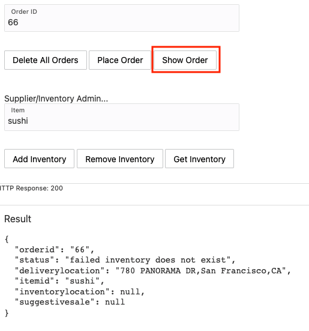

# Walkthrough the Grabdish Functionality Implemented in PL/SQL

## Introduction

This lab will show you how to  walk through the Grabdish application functionality written in PL/SQL and explain how it works.

Estimated Time: 10 minutes

### Objectives

-   Access the microservices
-   Learn how they work

### Prerequisites

* The Grabdish application you deployed in Lab 2

## Task 1: Verify the Order and Inventory Functionality of GrabDish Store

1.  Click **Transactional** under **Labs**.

   

2. Check the inventory of a given item such as sushi, by typing `sushi`
    in the `food` field and clicking **Get Inventory**. You should see the inventory
    count result 0.

   

3. (Optional) If for any reason you see a different count, click **Remove Inventory** to bring back the count to 0.

4. Let’s try to place an order for sushi by clicking **Place Order**.

   

5. To check the status of the order, click **Show Order**. You should see a failed
    order status.

   

   This is expected, because the inventory count for sushi was 0.

6. Click **Add Inventory** to add the sushi in the inventory. You
    should see the outcome being an incremental increase by 1.

   

7. Go ahead and place another order by increasing the order ID by 1 (67) and then clicking **Place Order**. Next click **Show Order** to check the order status.

   

   

   The order should have been successfully placed, which is shown by the order status showing success.

Although this might look like a basic transactional mechanic, the difference in the microservices environment is that it’s not using a two-phase XA commit, and therefore not using distributed locks. In a microservices environment with potential latency in the network, service failures during the communication phase or delays in long running activities, an application shouldn’t have locking across the services. Instead, the pattern that is used is called the saga pattern, which instead of defining commits and rollbacks, allows each service to perform its own local transaction and publish an event. The other services listen to that event and perform the next local transaction.

The frontend application is communicating with the order service to place an order. The order service is then inserting the order into the order database, while also sending a message describing that order. This approach is called the event sourcing pattern, which due to its decoupled non-locking nature is prominently used in microservices. The event sourcing pattern entails sending an event message for every work or any data manipulation that was conducted. In this example, while the order was inserted in the order database, an event message was also created in the Advanced Queue of the Oracle database.

Implementing the messaging queue inside the Oracle database provides a unique capability of performing the event sourcing actions (manipulating data and sending an event message) atomically within the same transaction. The benefit of this approach is that it provides a guaranteed once delivery, and it doesn’t require writing additional application logic to handle possible duplicate message deliveries, as it would be the case with solutions using separate datastores and event messaging platforms.

In this example, once the order was inserted into the Oracle database, an event message was also sent to the interested parties, which in this case is the inventory service. The inventory service receives the message and checks the inventory database, modifies the inventory if necessary, and sends back a message if the inventory exists or not. The inventory message is picked up by the order service which based on the outcome message, sends back to the frontend a successful or failed order status.

The services do not talk directly to each other, as each service is isolated and accesses its datastore, while the only communication path is through the messaging queue.

This architecture is tied with the Command Query Responsibility Segregation (CQRS) pattern, meaning that the command and query operations use different methods. In our example the command was to insert an order into the database, while the query on the order is receiving events from different interested parties and putting them together (from suggestive sales, inventory, etc). Instead of actually going to suggestive sales service or inventory service to get the necessary information, the service is receiving events.

You may now proceed to the next lab.

## Acknowledgements
* **Author** - Richard Exley, Consulting Member of Technical Staff, Oracle MAA and Exadata
* **Contributors** - Paul Parkinson, Architect and Developer Evangelist
* **Last Updated By/Date** - Richard Exley, April 2022
