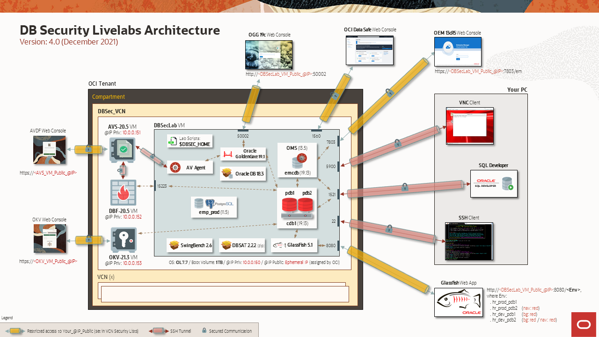

# Introduction

## About this Workshop
### Overview
*Estimated Time to complete the workshop*: 30 minutes

This workshop is a hands-on lab dedicated to the features and functionality of Oracle database security against the most common cyberattacks - for more details on each of the featured products, please refer to the Livelabs *DB Security Basics* and *DB Security Advanced*.

Based on an OCI architecture, deployed in a few minutes with a simple internet connection, it allows you to test DB Security use cases in a complete environment already pre-configured by the Oracle Database Security Product Manager Team.

Now, you no longer need important resources on your PC (storage, CPU or memory), nor complex tools to master, making you completely autonomous to discover at your rhythm all new DB Security features.

### Objectives
During this workshop, you will perform different actions:
- **as an attacker** - your main objective will be to exfiltrate sensitive data from the target database before encrypting data with a Ransomware
- **as a defender** - your main objective will be to prevent, detect and mitigate these attacks

In order to make this possible, we provide you with all the necessary application chain so that you can test the main attack protocols usually exploited on a database by hackers.

You will use the following resources:
  - SSH Terminal Client
  - Glassfish HR App

Note that the Glassfish HR application is a fictitious employee management web application that points to an unsecured Oracle database named pdb1.

As your attack protocol progresses, you will test exactly the same commands, from exactly the same interfaces, but pointing to another Oracle database named pdb2 which this time will be secured by Oracle solutions. This way, you will easily see which assets can be protected, as well as which protocol can be detected and mitigated by Oracle solutions, and how to do it.

As all these components are stored in the DBSec-Lab VM, you can conduct your attack without any risk and without fear of breaking anything.

### Components
The complete architecture of the **DB Security Hands-On Labs (v4)** is as following:

  

It's composed of 4 VMs:
  - **DBSec-Lab VM**
  - **Audit Vault Server VM**
  - **DB Firewall Server VM**
  - **Key Vault Server VM**

So that your experience of this workshop is the best possible, DO NOT FORGET to perform "Lab: *Initialize Environment*" to be sure that all these resources are correctly set!

The entire DB Security PMs Team wishes you an excellent workshop!

You may now [proceed to the next lab](#next).

## Acknowledgements
- **Author** - Hakim Loumi, Database Security PM
- **Contributors** - Rene Fontcha
- **Last Updated By/Date** - Hakim Loumi, Database Security PM - May 2022
