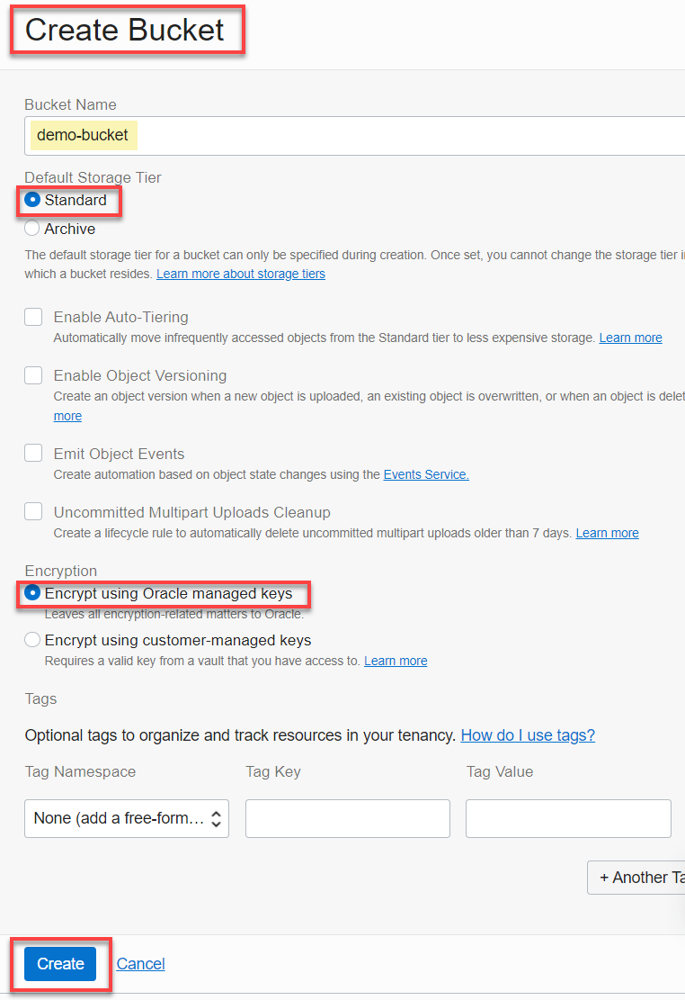

# How can I create a bucket in Oracle Cloud?

Duration: 2 minutes

## Create a Bucket

You can create an Object Storage bucket to store your data as follows:

1. Open the **Navigation** menu in the Oracle Cloud console and click **Storage**. Under **Object Storage & Archive Storage**, click **Buckets**.

2. On the **Buckets** page, select the compartment where you want to create the bucket from the **Compartment** drop-down list in the **List Scope** section. Make sure you are in the region where you want to create your bucket.

3. Click **Create Bucket**.

4. In the **Create Bucket** panel, specify the following:
    - **Bucket Name:** Enter a meaningful name for the bucket.
    - **Default Storage Tier:** Accept the default **Standard** storage tier. Use this tier for storing frequently accessed data that requires fast and immediate access. For infrequent access, choose the **Archive** storage tier.
    - **Encryption:** Accept the default **Encrypt using Oracle managed keys**.

5. Click **Create** to create the bucket.

  

6. The new bucket is displayed on the **Buckets** page.

  

## Learn More

* [Explore more about Object Storage in Oracle Cloud.](https://docs.oracle.com/en-us/iaas/Content/Object/home.htm)
